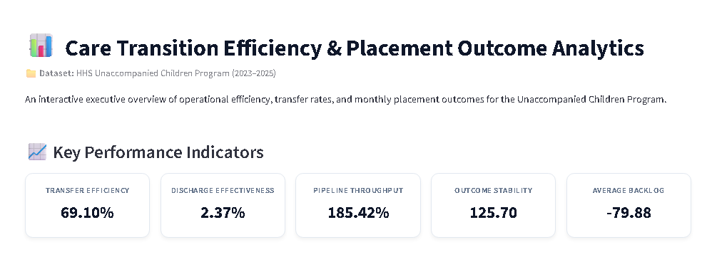
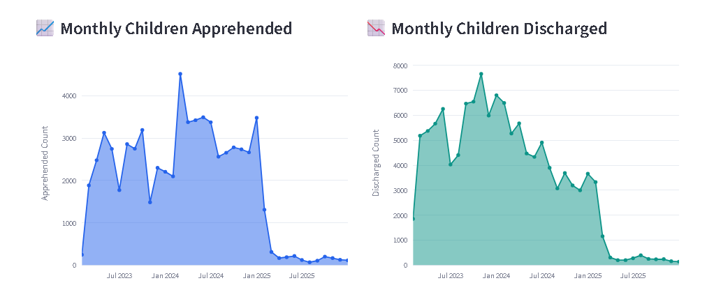

<div align="center">

# 📊 Care Transition Efficiency & Placement Outcome Analytics

**An interactive, executive-grade healthcare analytics dashboard designed to monitor and optimize care transitions.**

[](https://www.python.org/)
[](https://streamlit.io/)
[](https://plotly.com/)
[](https://pandas.pydata.org/)

</div>

---

## 📷 Dashboard Preview

| Executive Overview | Interactive Trends |
| :---: | :---: |
|  |  |

---
---

## 🌐 Live Demo

🚀 **Experience the interactive dashboard here:**

👉 **[Launch Care Transition Analytics Dashboard](https://care-transition-analytics-lfqqse9lnazvdlw3mb4yhn.streamlit.app/)**


## 📖 Project Overview

This project provides end-to-end data processing and visualization for the **HHS Unaccompanied Children Program**. It converts complex operational records into interactive business intelligence dashboards, allowing decision-makers to track operational performance, monitor transfer bottleneck trends, and analyze placement outcomes.

Developed as a core **Data Analytics & AI/ML Project (2026)**.

---

## 🎯 Objectives & Value Delivered

* **⚡ Optimize Handoff Efficiency:** Monitor transfer velocity between CBP custody and HHS care facilities.
* **📈 Trend Identification:** Track monthly apprehension spikes and discharge capacity across 2023–2025.
* **🚨 Bottleneck Reduction:** Quantify backlog accumulation to ensure steady discharge velocity.
* **🖥️ Executive Visibility:** Deliver a clean, responsive Streamlit dashboard built for quick decision-making.

---

## 📊 Key Performance Indicators (KPIs)

The dashboard computes and monitors **5 critical operational metrics**:

| Metric | Formula / Logic | Description |
| :--- | :--- | :--- |
| **Transfer Efficiency** | $\frac{\text{Transferred out of CBP}}{\text{Children in CBP Custody}}$ | Measures speed and stability of facility transfers |
| **Discharge Effectiveness** | $\frac{\text{Discharged from HHS}}{\text{Children in HHS Care}}$ | Evaluates HHS placement speed |
| **Pipeline Throughput** | $\frac{\text{Discharged from HHS}}{\text{Apprehended \& Placed in CBP}}$ | Identifies total operational discharge capacity |
| **Outcome Stability** | $\text{Std. Dev of Discharges}$ | Measures consistency of monthly placements |
| **Average Backlog** | $\text{Apprehended} - \text{Discharged}$ | Tracks net flow accumulation across facilities |

---

## 🚀 Key Features

- 💎 **Modern Executive UI:** High-contrast CSS KPI cards and aligned multi-column visual hierarchy.
- 📉 **Gradient Area Charts:** Interactive Plotly visual plots with customized tooltips and non-cluttered controls.
- 🎛️ **Dynamic Time Filters:** Interactive sidebar controls to slice and filter data across custom date ranges.
- 💡 **Automated Business Insights:** Highlighting operational wins and volume drops in clean callout panels.
- 📁 **Cleaned Dataset View:** Formatted dates (`YYYY-MM-DD`) and clean percentages in raw data view.

---

## 💡 Key Business Insights

> ⚡ **Transfer Efficiency:** Averaged **69.10%**, demonstrating steady operational handoff across facilities.

> 📈 **2024 Peak & Subsequent Decline:** Monthly apprehensions peaked in **early 2024** before experiencing a sharp downward trend entering 2025.

> 🔄 **High Pipeline Throughput:** Throughput exceeded **100%**, reflecting significant discharges from backlog admitted prior to the observation window.

> 📉 **Negative Backlog Accumulation:** Average backlog remained negative, confirming that discharge velocity effectively outpaced incoming apprehensions.

---

## 🛠️ Tech Stack & Tools

* **Core Language:** Python 3.9+
* **Web Framework:** Streamlit
* **Visualization:** Plotly Express / Graph Objects
* **Data Manipulation:** Pandas, NumPy
* **Styling:** Custom CSS (Flexbox, CSS Cards)

---

## 📁 Repository Structure

```text
care_transition_analytics/
│
├── app.py                     # Main Streamlit application
├── requirements.txt           # Python project dependencies
├── README.md                  # Comprehensive project documentation
│
├── data/
│   └── healthcare.csv         # Processed operational dataset (720 records)
│
├── notebook/
│   └── Healthcare_Analysis.ipynb  # Exploratory Data Analysis (EDA) notebook
│
└── images/                    # Screenshot assets for documentation

---
```
## 👨‍💻 Author

<div align="center">

### **Saif Chogle**
*Data Analytics & AI/ML Developer*

[](https://www.linkedin.com/in/saif-chogle)
[](https://github.com/Saif-codes-cell)
[](mailto:choglesaif5@gmail.com)

<br>

*Developed as part of an **AI/ML Internship Project (2026)**.*

</div>
